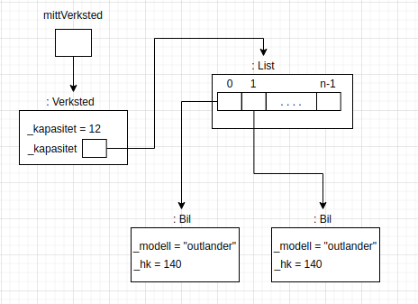
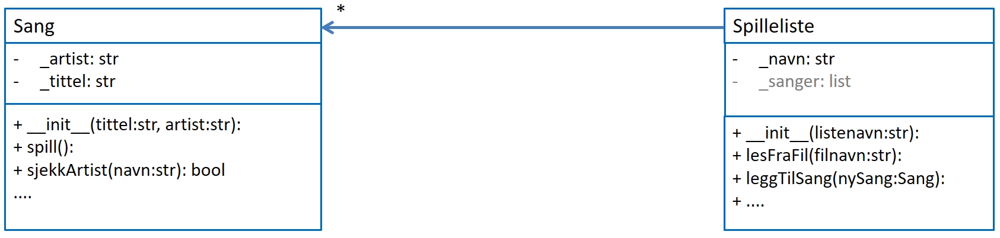

# Ressurser for eksamensforberedelser | IN1000

## Eksamener
-   [Link til emnesiden](https://www.uio.no/studier/emner/matnat/ifi/IN1000/h20/eksamensoppgaver-og-losninger)

## Datastrukturtegning/UML

**Tips**: https://draw.io

En datastrukturtegning er en representasjon av programmet i et punkt i kjøringen. Typisk eksempel:

Klassediagram/UML er en statisk representasjon av et program. Viser forholdet mellom klasser:

-   `+` for public metoder/variabler, `-` for private.
-   Notasjon for mengder:
    -   `*` for null eller mange.
    -   `1..*` en eller mange.
    -   `0..2` 0, 1 eller 2.
    -   `x` betyr nøyaktig x.

## Øvrige oppgaver

### Regneklynge

Veldig relevant til eksamen. Dette er en frivillig oppgave i format av en oblig. Link til oppgavetekst, input-filer og ekstra info [finner dere her.](https://www.uio.no/studier/emner/matnat/ifi/IN1000/h20/ressurser-per-uke/uke12/datasenter-oppgave/index.html)

### Studentsystem

**Oppgave 1**
1.1 Lag en klasse “Fag”, som skal ha et navn og en liste som holder på alle studentene som tar det aktuelle faget. Ved opprettelsen av et fag vil denne studentlisten være tom. 

1.2 Lag en metode i Fag-klassen som heter “leggTilStudent(student)” som tar imot en Student som parameter og legger den til i listen. Hvor i listen du legger den til spiller ingen rolle, så du må gjerne bruke .append(). 

1.3 Lag en metode i Fag-klassen som returnerer antallet studenter som tar faget, kall denne “hentAntallStudenter()”.

1.4 Lag en metode som returnerer fagets navn, hentFagNavn(). 

1.5 Lag en metode “skrivStudenterVedFag()” som skriver ut fagnavnet, og deretter alle studentene som tar faget. 
Merk: Anta at metoden hentStudentNavn() er implementert Student-objektet. 

**Oppgave 2**
2.1 Lag en klasse “Student”. Studenten skal ha et navn og en liste som holder på fagene studentene tar. Ved opprettelsen av en student vil denne faglisten være tom. 

2.2 Legg til en metode i Student-klassen som heter “leggTilFag(fag)” som tar imot et fag som parameter og legger det til i studentens liste over fag. 

2.3 Lag en metode i Student-klassen som returnerer antallet fag studenten tar, kall denne “hentAntallFag()”.  

2.4 Lag en metode i Student-klassen som returnerer studentens navn, hentStudentNavn(). 

2.5 Lag en metode “skrivFagPaaStudent()” som skriver ut studentens navn, og deretter alle fagene som studenten tar. 
Her må du bruke hentFagNavn() fra Fag-objektet. 

**Oppgave 3**
Lag et lite testprogram hvor du lager noen studenter og noen fag. Legg til fagene i studentenes liste og studentene inn i fagene. Skriv ut hvor mange fag studentene dine tar, og hvor mange studenter hver av fagene dine tar. 

[Del to av studentsystem finner dere her](./studentsystem_part2.pdf)

### [Trix](https://trix.ifi.uio.no/course/8)